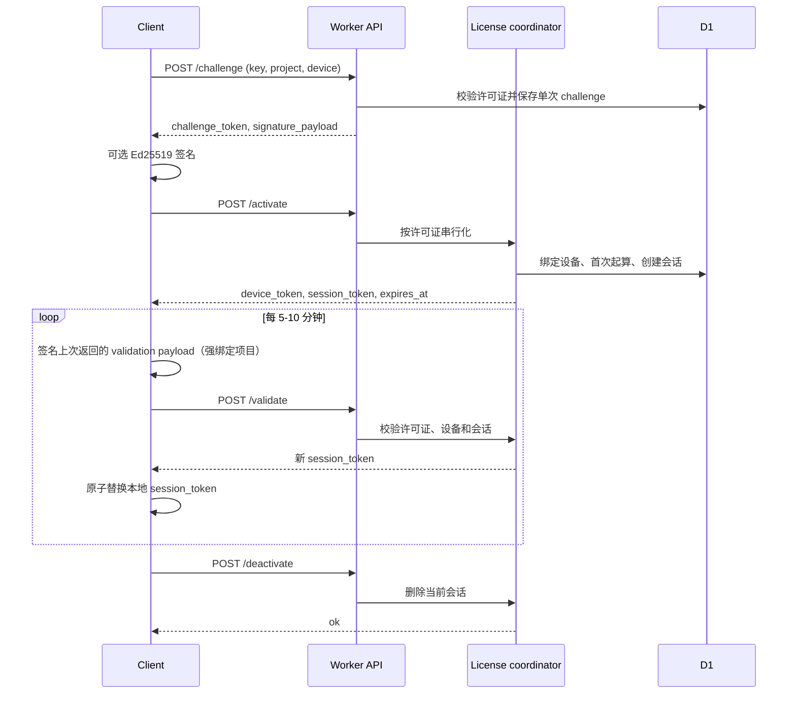

# 客户端接入

当前生产 `BASE_URL`：`https://license.145156.xyz`。客户端仅调用 `/api/public/*`，不使用管理台账号、密码或管理会话。

公开 API 使用 JSON over HTTPS。首次接入按 `challenge -> activate` 执行；激活后定时调用 `validate`，每次成功验证都会轮换 `session_token`。`deactivate` 只结束当前会话，不会释放设备名额。

> 公开接口会把无效 key、过期、设备超限、签名失败等统一返回为 `HTTP 400` 和 `{"ok":false,"error":"request_rejected"}`。客户端不得依赖更细的失败原因。

## 接入前准备

| 参数 | 从哪里取得 | 客户端如何保存 |
|---|---|---|
| `BASE_URL` | Worker 的 `workers.dev` 地址或自定义域名，例如 `https://license.example.com` | 应用配置 |
| `PROJECT_ID` | 管理台创建项目后返回的项目 ID | 应用配置；不同应用使用不同 ID |
| `LICENSE_KEY` | 管理台生成或授权码列表中复制的 `ELC-...` 卡密 | 首次激活时由用户输入；不要写入日志 |
| `DEVICE_ID` | 客户端首次运行生成的随机安装 UUID | 系统安全存储；同一安装内保持不变 |
| Ed25519 密钥对 | 强设备项目由客户端首次运行生成 | 私钥放入系统密钥库，公钥可随 challenge 发送 |

客户端只调用 `/api/public/*`。`ADMIN_API_TOKEN` 和 `KEY_PEPPER` 都是服务端 secret，绝不能编译进客户端、下发给客户端或加入客户端请求。

业务代码的最小接入点是：应用启动时加载本地会话；有会话就先 `validate`，没有会话就执行 `challenge -> activate`。只有收到 `ok: true` 后才开放授权功能，并在活跃期间每 5-10 分钟续验。

## 协议概览



所有时间均为 Unix 秒。请求体最大 64 KiB，并且必须发送 `Content-Type: application/json`。

| 操作 | 方法和路径 | 成功结果 | 重要语义 |
|---|---|---|---|
| 获取 challenge | `POST /api/public/challenge` | `challenge_token`、`challenge`、`expires_at`、`signature_payload`、`signature_required` | challenge 有效 120 秒且只能使用一次 |
| 首次激活或同设备重激活 | `POST /api/public/activate` | `license_id`、许可证 `expires_at`、`session_token`、`device_token`、下一次验证的 `signature_payload` | 首次成功激活开始计算许可证有效期 |
| 在线验证 | `POST /api/public/validate` | `license_id`、许可证 `expires_at`、新的 `session_token` 和下一次 `signature_payload` | 成功后旧 `session_token` 和旧验证 challenge 立即失效；`device_token` 不变 |
| 结束会话 | `POST /api/public/deactivate` | `{"ok":true}` | 仅删除会话；释放设备名额需管理员撤销设备或重置设备 |

请求字段：

| 路径 | 必填字段 | 条件字段 |
|---|---|---|
| `/api/public/challenge` | `project_id`、`license_key`、`device_id` | 项目要求签名时必须有 `device_public_key` |
| `/api/public/activate` | `project_id`、`license_key`、`device_id`、`challenge_token` | challenge 要求签名时必须有原 challenge 使用的 `device_public_key` 和 `signature` |
| `/api/public/validate` | `project_id`、`session_token`、`device_token` | 项目要求签名时，必须提交对上次响应 `signature_payload` 的 `signature` |
| `/api/public/deactivate` | `project_id`、`session_token`、`device_token` | 无 |

## 通过 curl 接入

先设置环境变量：

```bash
export BASE_URL="https://license.example.com"
export PROJECT_ID="00000000-0000-0000-0000-000000000000"
export LICENSE_KEY="ELC-replace-with-the-issued-key"
export DEVICE_ID="$(uuidgen)" # 首次生成后持久化，同一安装不要重复生成
```

获取 challenge：

```bash
curl --fail-with-body --silent --show-error \
  -X POST "$BASE_URL/api/public/challenge" \
  -H 'Content-Type: application/json' \
  --data "{\"project_id\":\"$PROJECT_ID\",\"license_key\":\"$LICENSE_KEY\",\"device_id\":\"$DEVICE_ID\"}"
```

没有启用设备签名时，使用上一步响应中的 `challenge_token` 激活：

```bash
export CHALLENGE_TOKEN="replace-with-challenge-token"
curl --fail-with-body --silent --show-error \
  -X POST "$BASE_URL/api/public/activate" \
  -H 'Content-Type: application/json' \
  --data "{\"project_id\":\"$PROJECT_ID\",\"license_key\":\"$LICENSE_KEY\",\"device_id\":\"$DEVICE_ID\",\"challenge_token\":\"$CHALLENGE_TOKEN\"}"
```

验证会话。保存响应中的新 `session_token`，覆盖旧值：

```bash
export SESSION_TOKEN="replace-with-current-session-token"
export DEVICE_TOKEN="replace-with-device-token"
curl --fail-with-body --silent --show-error \
  -X POST "$BASE_URL/api/public/validate" \
  -H 'Content-Type: application/json' \
  --data "{\"project_id\":\"$PROJECT_ID\",\"session_token\":\"$SESSION_TOKEN\",\"device_token\":\"$DEVICE_TOKEN\"}"
```

结束当前会话：

```bash
curl --fail-with-body --silent --show-error \
  -X POST "$BASE_URL/api/public/deactivate" \
  -H 'Content-Type: application/json' \
  --data "{\"project_id\":\"$PROJECT_ID\",\"session_token\":\"$SESSION_TOKEN\",\"device_token\":\"$DEVICE_TOKEN\"}"
```

## 启用 Ed25519 设备证明

项目的 `require_device_signature` 为 `true` 时：

1. 客户端首次运行生成 Ed25519 密钥对并持久保存私钥。
2. 调用 challenge 时发送 32 字节原始公钥的 base64url 值 `device_public_key`。
3. 对响应里的 UTF-8 `signature_payload` 原样签名。
4. 激活时同时发送相同的 `device_public_key` 和 64 字节签名的 base64url 值 `signature`。
5. 保存激活响应中的验证 `signature_payload`；每次 validate 前签名该值并提交 `signature`。
6. validate 成功后原子替换 `session_token` 和下一次 `signature_payload`，旧值不得复用。

激活 challenge 返回的 `signature_payload` 当前格式为：

```text
<challenge>.<device_id>.<project_id>
```

activate 和 validate 响应里用于下一次在线验证的 `signature_payload` 当前格式为：

```text
validate.<validation_challenge>.<project_id>
```

应直接签名服务端返回的 `signature_payload`，不要由客户端重新拼接。base64url 不带 `=` padding。

## 可运行 Node.js 客户端

以下示例只依赖 Node.js 20+。它生成并复用设备身份、支持可选 Ed25519 签名、原子保存轮换后的会话，并提供 `activate`、`validate`、`deactivate` 三个命令。

```javascript
// license-client.mjs
import {
  createPrivateKey,
  generateKeyPairSync,
  randomUUID,
  sign,
} from "node:crypto";
import { chmod, readFile, rename, writeFile } from "node:fs/promises";

const baseUrl = process.env.LICENSE_BASE_URL?.replace(/\/$/, "");
const projectId = process.env.LICENSE_PROJECT_ID;
const licenseKey = process.env.LICENSE_KEY;
const statePath = process.env.LICENSE_STATE_PATH ?? ".edge-license-session.json";
const command = process.argv[2] ?? "validate";

if (!baseUrl || !projectId) {
  throw new Error("Set LICENSE_BASE_URL and LICENSE_PROJECT_ID");
}

const b64url = (value) => Buffer.from(value).toString("base64url");

async function loadState() {
  try {
    return JSON.parse(await readFile(statePath, "utf8"));
  } catch (error) {
    if (error?.code !== "ENOENT") throw error;
    return {};
  }
}

async function saveState(state) {
  const temporary = `${statePath}.${process.pid}.tmp`;
  await writeFile(temporary, `${JSON.stringify(state, null, 2)}\n`, { mode: 0o600 });
  await rename(temporary, statePath);
  await chmod(statePath, 0o600).catch(() => {});
}

function ensureDeviceIdentity(state) {
  if (state.device_id && state.device_public_key && state.device_private_key) return state;
  const { publicKey, privateKey } = generateKeyPairSync("ed25519");
  const spki = publicKey.export({ type: "spki", format: "der" });
  return {
    ...state,
    device_id: randomUUID(),
    device_public_key: b64url(spki.subarray(spki.length - 32)),
    device_private_key: privateKey.export({ type: "pkcs8", format: "pem" }),
  };
}

async function post(path, body, attempts = 3) {
  for (let attempt = 0; ; attempt += 1) {
    const controller = new AbortController();
    const timeout = setTimeout(() => controller.abort(), 10_000);
    let retryDelay = 250 * 2 ** attempt + Math.random() * 250;
    let lastError;
    try {
      const response = await fetch(`${baseUrl}${path}`, {
        method: "POST",
        headers: { "content-type": "application/json" },
        body: JSON.stringify(body),
        signal: controller.signal,
      });
      const payload = await response.json().catch(() => ({}));
      if (response.ok) return payload;
      if (response.status !== 429 && response.status < 500) {
        throw new Error(`license request rejected (${response.status}): ${JSON.stringify(payload)}`);
      }
      lastError = new Error(`license service unavailable (${response.status})`);
      if (response.status === 429) {
        const retryAfter = Number(response.headers.get("retry-after"));
        if (Number.isFinite(retryAfter) && retryAfter > 0) {
          retryDelay = Math.max(retryDelay, retryAfter * 1000);
        }
      }
    } catch (error) {
      if (/request rejected/.test(String(error))) throw error;
      lastError = error;
    } finally {
      clearTimeout(timeout);
    }
    if (attempt + 1 >= attempts) throw lastError;
    await new Promise((resolve) => setTimeout(resolve, retryDelay));
  }
}

async function activate(state) {
  if (!licenseKey) throw new Error("Set LICENSE_KEY for activation");
  const challenge = await post("/api/public/challenge", {
    project_id: projectId,
    license_key: licenseKey,
    device_id: state.device_id,
    device_public_key: state.device_public_key,
  });
  const activation = {
    project_id: projectId,
    license_key: licenseKey,
    device_id: state.device_id,
    challenge_token: challenge.challenge_token,
    device_public_key: state.device_public_key,
  };
  if (challenge.signature_required) {
    activation.signature = b64url(sign(
      null,
      Buffer.from(challenge.signature_payload, "utf8"),
      createPrivateKey(state.device_private_key),
    ));
  }
  const result = await post("/api/public/activate", activation, 1);
  return {
    ...state,
    license_id: result.license_id,
    license_expires_at: result.expires_at,
    session_token: result.session_token,
    device_token: result.device_token,
    signature_required: result.signature_required,
    validation_signature_payload: result.signature_payload,
    session_renewed_at: Math.floor(Date.now() / 1000),
  };
}

async function validate(state) {
  if (!state.session_token || !state.device_token) return activate(state);
  const request = {
    project_id: projectId,
    session_token: state.session_token,
    device_token: state.device_token,
  };
  if (state.signature_required) {
    if (!state.validation_signature_payload) throw new Error("Missing validation signature payload");
    request.signature = b64url(sign(
      null,
      Buffer.from(state.validation_signature_payload, "utf8"),
      createPrivateKey(state.device_private_key),
    ));
  }
  const result = await post("/api/public/validate", request, 1);
  return {
    ...state,
    license_expires_at: result.expires_at,
    session_token: result.session_token,
    signature_required: result.signature_required,
    validation_signature_payload: result.signature_payload,
    session_renewed_at: Math.floor(Date.now() / 1000),
  };
}

let state = ensureDeviceIdentity(await loadState());
// 在任何网络请求前固定设备身份，避免激活响应丢失后生成新设备并占用第二个名额。
await saveState(state);
if (command === "activate") {
  state = await activate(state);
  await saveState(state);
} else if (command === "validate") {
  try {
    state = await validate(state);
  } catch (error) {
    // validate 可能已在服务端完成轮换但响应丢失；用同一设备重新激活以恢复会话。
    if (!licenseKey) throw error;
    state = await activate(state);
  }
  await saveState(state);
} else if (command === "deactivate") {
  try {
    if (state.session_token && state.device_token) {
      await post("/api/public/deactivate", {
        project_id: projectId,
        session_token: state.session_token,
        device_token: state.device_token,
      }, 1);
    }
  } finally {
    delete state.session_token;
    delete state.device_token;
    delete state.session_renewed_at;
    delete state.validation_signature_payload;
    await saveState(state);
  }
} else {
  throw new Error("Usage: node license-client.mjs activate|validate|deactivate");
}

console.log(JSON.stringify({
  ok: true,
  command,
  license_id: state.license_id,
  expires_at: state.license_expires_at,
}, null, 2));
```

运行：

```bash
export LICENSE_BASE_URL="https://license.example.com"
export LICENSE_PROJECT_ID="00000000-0000-0000-0000-000000000000"
export LICENSE_KEY="ELC-replace-with-the-issued-key"
node license-client.mjs activate
node license-client.mjs validate
node license-client.mjs deactivate
```

示例把私钥保存在权限受限文件中以便直接运行。生产客户端应改用 Keychain、Android Keystore、Windows CNG/DPAPI、TPM 或其他不可导出密钥存储。

## 验证频率、重试和缓存

- 会话服务端有效期为 15 分钟。前台应用建议启动时验证，并在活跃期间每 5-10 分钟验证一次。
- `validate` 成功会删除旧会话并返回新 `session_token`。收到成功响应后必须先原子落盘，再开放受许可功能。
- 获取 challenge 遇到网络中断、超时、`429` 或 `5xx` 时使用 exponential backoff + full jitter。公开接口的 `400 request_rejected` 不做相同请求重试。
- activate、validate 和 deactivate 会改变服务端状态，且当前协议没有 idempotency key；响应结果不明时不要盲目重放相同 token。
- challenge 过期、activate 返回 `400`，或者 activate/validate 的响应丢失时，使用同一持久化设备身份重新获取 challenge，再至多重做一次完整激活。validate 可能已在服务端成功并使旧 token 失效，因此不得循环重放旧 token。
- deactivate 的响应丢失时在本地清除会话；即使服务端未收到请求，该 session 也会在最多 15 分钟后过期。
- 本地缓存只保存当前 token；不得保留 token 历史。更新使用临时文件加原子 rename，并用单实例锁防止两个进程同时验证造成 token 竞争。
- `device_id` 必须在同一安装内稳定，卸载或明确“重置设备”时才更换。随机安装 UUID 比可变硬件拼接值更稳；它本身不构成身份认证。
- 本地时间只用于 UI 提示。是否过期以服务端结果为准。
- 许可证 key 建议只在首次激活或会话恢复时读取；生产环境不要与 session/device token 一起写入普通配置文件。

## 集成检查

1. 同一 challenge 第二次激活返回统一拒绝。
2. 成功 validate 后旧 `session_token` 返回统一拒绝，新 token 成功。
3. 停用许可证、撤销设备或重置设备后，已有会话失效。
4. `max_devices` 达到上限后，新 `device_id` 被拒；已有设备可重新激活。
5. 开启设备签名后，缺少签名、修改 payload、换公钥或换 device ID 均被拒。
6. deactivate 后 validate 失败，但该设备仍占用设备名额。
