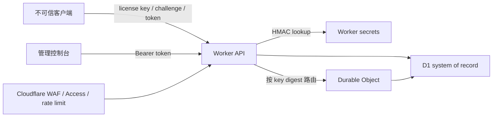

# 安全与运维

> 2026-08-07 认证更新：浏览器管理台现使用账号密码登录并换取 8 小时 HMAC 签名会话。本文后续出现的 `ADMIN_API_TOKEN` 仅指兼容的自动化 service token；浏览器不再要求输入该 token。详见 [ADMIN-LOGIN.md](ADMIN-LOGIN.md)。

> 2026-08-07 卡密可见性更新：新生成卡密除 `KEY_PEPPER` 摘要外，还使用独立 `LICENSE_KEY_ENCRYPTION_SECRET` 通过 AES-256-GCM 加密保存。管理列表可解密显示和复制完整卡密；D1 不保存明文。该密钥必须独立托管和备份，丢失后已生成卡密仍可验证，但后台无法再次显示明文。

本文以当前 Worker、D1 和 Durable Object 实现为准。应用内已实现的控制与部署平台需要配置的控制分开列出；CORS 不是认证机制，公开许可证接口也必须经 HTTPS 暴露。

## 信任边界



当前实现的关键属性：

- D1 使用 `HMAC-SHA-256(KEY_PEPPER, raw_key)` 做验证查找，并使用独立密钥生成 AES-256-GCM 密文供管理员恢复显示；不保存明文许可证 key。
- challenge 绑定许可证、项目、设备 ID 哈希和可选设备公钥，120 秒过期且单次使用。
- 同一许可证的激活由 Durable Object 串行化，设备上限检查和写入不会并发抢占。
- session、device token 和 challenge token 均只以 HMAC digest 存入 D1；强绑定项目的每次在线验证还要求设备私钥签名一次性 validation challenge。
- 公开失败统一为 `400 request_rejected`，降低许可证枚举信号。
- API 响应设置 `Cache-Control: no-store` 和 `X-Content-Type-Options: nosniff`。
- 管理 API 使用 `ADMIN_API_TOKEN` Bearer token，并使用定长工作量的字符串比较。

## 一张许可证的使用边界

当前数据模型中，一张许可证严格属于一个 `project_id`，不能跨项目使用。许可证生成时会复制套餐的 `duration_seconds` 和 `max_devices`，因此之后调整套餐不会改变已发许可证。

`max_devices` 允许范围是 1-100：

- 首次成功 activate 写入 `activated_at`，并将 `expires_at` 固定为 `activated_at + duration_seconds`。
- 同一 `device_id` 重复激活复用设备记录、轮换 device/session token，不新增设备名额。
- 不同 `device_id` 会占用新名额；达到上限后激活统一拒绝。
- deactivate 只结束一个会话，不撤销设备绑定，也不释放名额。
- 管理员的单设备 revoke 或许可证 reset-devices 会删除相关会话并将设备标为 revoked，从而释放 active 名额。
- disable 许可证会删除全部会话；再次 enable 不会恢复旧会话。

设备上限限制并不能阻止一个被复制的普通 `device_id` 在多台机器共用。要求更强绑定时必须启用设备 Ed25519 签名。

## 设备密钥

启用 `require_device_signature` 后，客户端在 challenge 阶段提交 32 字节 Ed25519 原始公钥，在 activate 阶段证明对应私钥的持有，并对每次 validate 使用的单次 challenge 继续签名。私钥应由系统密钥库生成并尽量设为不可导出：

| 平台 | 推荐存储 | 额外约束 |
|---|---|---|
| Android | Android Keystore | 使用硬件支持、StrongBox（可用时）和应用签名绑定 |
| Apple | Keychain / Secure Enclave | 设置仅本设备可用和适当 access control |
| Windows | CNG/TPM 或 DPAPI | 优先 machine/user scoped 非导出密钥 |
| Linux | TPM2 或 Secret Service | 限制文件权限仍只是兼容回退 |

`device_id` 应是稳定的安装 UUID，不应包含序列号、MAC、用户名等直接身份信息。服务端存储的是其 HMAC digest；日志也不得记录原值。

设备签名使单纯复制 session/device token 无法在另一台机器续租，但客户端仍处于用户控制范围。服务端应把短会话、撤销、异常检测和平台证明组合使用，而不是把硬件指纹当成唯一信任根。

## 限流与滥用防护

应用已绑定平台 Rate Limit API，默认按 IP + 公开路径限制为每分钟 60 次，并以相同公开错误 body 返回 429。该值只是兜底；生产部署仍应在 Cloudflare WAF/Rate Limiting Rules 配置更细的边缘规则：

| 路径 | 建议初始阈值 | 维度 | 动作 |
|---|---:|---|---|
| `/api/public/challenge` | 10 次/分钟，突发 20 | IP + ASN；另监测 key digest | 超限返回 429，重复滥用临时封禁 |
| `/api/public/activate` | 5 次/分钟 | IP + 设备；服务内按许可证串行化 | 429 + 指数退避 |
| `/api/public/validate` | 30 次/分钟 | IP + device/session | 429；避免正常 5 分钟心跳误伤 |
| `/api/admin/*` | 60 次/分钟 | Access identity + IP | 429；高影响写操作使用更低阈值 |

阈值应根据真实并发和 NAT 用户比例压测后调整。不要把 D1 当作每请求限流计数器；需要应用内精确计数时，应使用 Durable Object。对 key digest 的限流只能在服务内部完成，边缘规则不得接触或记录原始许可证 key。

同时设置请求体上限、bot 管理、异常国家/ASN 告警和成本预算告警。定时任务每小时清理过期 challenge 和 session，但它不是限流替代品。

## 管理面认证

当前 Worker 接受：

```http
Authorization: Bearer <ADMIN_API_TOKEN>
```

`ADMIN_API_TOKEN` 是全局管理员共享密钥，适合单租户最小部署。生产环境应在 Worker 前增加 Cloudflare Access/OIDC + MFA，并限制管理路径来源；当前代码没有用户级 RBAC，因此 Access 身份只形成第二道门，Worker 内仍由共享 token 授权。

最低配置：

1. `ADMIN_API_TOKEN` 使用至少 32 个随机字节，不进入仓库、前端 bundle、日志或命令历史。
2. 只把管理 token 注入 Worker secret；控制台通过同源后端调用，避免浏览器持久保存 token。
3. `TRUSTED_ORIGINS` 只列明确控制台 origin。CORS allowlist 只限制浏览器读取，不替代 Access 或 Bearer token。
4. 对 project create/update、license batch/enable/disable/reset、device revoke 设置告警并审查 `audit_events`。
5. 多管理员、多项目隔离场景需要在上线前增加 OIDC subject 和 project membership RBAC；当前管理 API 是全局权限。

## 密钥轮换

### 管理 token

当前实现只支持一个 `ADMIN_API_TOKEN`。轮换步骤：

1. 在维护窗口生成新随机 token，并更新所有受控管理客户端。
2. 更新 Worker secret 并部署。
3. 用新 token完成一次只读和一次受控写入验证。
4. 确认旧 token 返回 401，记录轮换审计和回滚负责人。

因为没有双 token 过渡，严格零停机轮换需要先把代码扩展为 current/previous token 短期并存。

### Key pepper

`KEY_PEPPER` 同时保护许可证 key、challenge、session、device token 和 device ID digest。直接替换会让所有现有 key 和 token 失配。当前 schema 没有 `pepper_version`，因此不能透明轮换。

发生例行轮换或泄漏响应时，应先实现版本化 HMAC：

1. 新增 `digest_version`，服务端用新 pepper 写入，同时用 current/previous pepper 查找。
2. 许可证成功使用旧 digest 时，在受控事务中重算并迁移为新 digest。
3. session、challenge 和 device token 是短期或可重发数据，可主动清空并要求重新激活。
4. 迁移覆盖率达到目标后移除旧 pepper，再删除旧 secret。

在版本化实现上线前，pepper 泄漏的现行处置是停止签发、轮换 secret、清空短期凭证并重新签发许可证。D1 备份不包含 Worker secrets；secret 必须单独托管和恢复。

## 日志与隐私

代码中的审计事件记录 project/license/device 行 UUID、事件类型、actor、request ID 和受控 details，不记录原始 key、session token、device token、challenge token、签名、设备 ID 或私钥。保持这一约束：

- 禁止记录完整请求/响应 body 和 `Authorization` header。
- 采集 HTTP 指标时只保留路由模板、状态码、延迟、CF Ray ID 和粗粒度地域。
- 错误跟踪发送前移除所有以 `*_token`、`license_key`、`signature`、`device_id` 命名的字段。
- `audit_events` 普通管理流只读，不提供 update/delete API；导出到不可变对象存储并设置保留期。
- 元数据 `metadata` 由管理员写入且最大 4 KiB，仍应禁止放入密码、token、个人身份信息或客户机指纹。

日志访问应独立授权，导出加密，保留时间按业务要求最小化，并周期性抽查泄漏。

## 备份、恢复与故障处置

备份范围：

- D1：项目、套餐、许可证 digest、设备绑定、审计事件。
- Worker 配置：`wrangler.jsonc`、migration 和已部署版本号。
- Secrets：`ADMIN_API_TOKEN`、`KEY_PEPPER` 存入独立 secret manager；不要写入 D1 导出。
- 前端静态构建和部署制品：保留可回滚版本与校验和。

建议每日至少一次可恢复快照或导出，并利用 D1 Time Travel 覆盖短期误操作。每季度执行恢复演练：

1. 在隔离环境创建新 D1 数据库并恢复选定时间点。
2. 绑定测试 Worker，注入对应时期的 secrets。
3. 验证许可证计数、关键 audit 时间线和随机抽样 digest。
4. 用测试许可证执行 challenge/activate/validate。
5. 记录 RPO、RTO 和无法恢复的数据，随后销毁隔离凭证。

不要把生产 Durable Object namespace 直接绑定到恢复演练。DO 只负责串行化；D1 是授权状态事实源。恢复到较早时间点可能重新启用已撤销许可证或设备，切换生产前必须重放恢复点之后的禁用/撤销事件，或先全量禁用再人工放行。

## 安全测试矩阵

| 编号 | 场景 | 操作 | 预期结果 |
|---|---|---|---|
| S01 | key 枚举 | 对不存在、禁用、过期 key 获取 challenge | 全部返回相同 400 body 和近似时延 |
| S02 | challenge 重放 | 同一 token 激活两次 | 仅第一次成功 |
| S03 | challenge 篡改 | 换 project、device ID 或公钥后激活 | 统一拒绝 |
| S04 | 签名篡改 | 修改 payload、签名或公钥 | 统一拒绝 |
| S05 | 设备并发 | 两个新设备同时争抢最后一个名额 | 恰好一个成功 |
| S06 | 同设备重激活 | 相同 device ID 再次走完整激活 | 不增加 active device 数；旧 token 失效 |
| S07 | 会话轮换 | validate 成功后分别使用旧、新 session token 和签名 challenge | 旧 token/challenge 拒绝，新 token/challenge 成功 |
| S08 | token 交叉 | A 的 session token 配 B 的 device token | 拒绝 |
| S09 | 项目隔离 | key/token 改为另一 project ID | 拒绝 |
| S10 | 许可证过期 | 跨过 expires_at 后 validate | 拒绝 |
| S11 | 禁用 | 管理员 disable 后验证现有会话 | 会话被删除并拒绝 |
| S12 | 设备撤销 | revoke 单设备后验证其会话 | 会话被删除并拒绝；其他设备不受影响 |
| S13 | 设备重置 | reset-devices 后检查所有绑定 | 全部 revoked，会话删除，新激活可占用名额 |
| S14 | deactivate | 结束会话后再次 validate | 拒绝；设备 active 数不变 |
| S15 | 请求约束 | 错误 Content-Type、畸形 JSON、超过 64 KiB | 公开接口统一拒绝，管理接口返回受控 4xx |
| S16 | 管理认证 | 缺失、错误、旧 Bearer token | 401 且无数据泄漏 |
| S17 | CORS | 非 allowlist origin 的预检或带 Origin 请求 | 403；无 Origin 的原生客户端仍由 token/challenge 控制 |
| S18 | 限流 | 超过各路由阈值 | 429、Retry-After/退避生效、无 key 枚举差异 |
| S19 | 日志脱敏 | 触发成功与失败路径并检查日志/审计 | 无 raw key/token/device ID/signature |
| S20 | 恢复演练 | 从快照恢复并重放撤销 | 业务状态一致，测试许可证完整闭环成功 |
| S21 | pepper 灾备 | 使用错误或新 pepper 启动隔离 Worker | 现有 key 均失配，告警并阻止误切生产 |
| S22 | 成本型 DoS | 高并发 challenge 与随机大 JSON | WAF/限流先拦截，D1/DO 使用量在预算内 |

上线门槛至少包括 S01-S19；涉及 pepper 轮换或生产恢复时同时执行 S20-S22。
